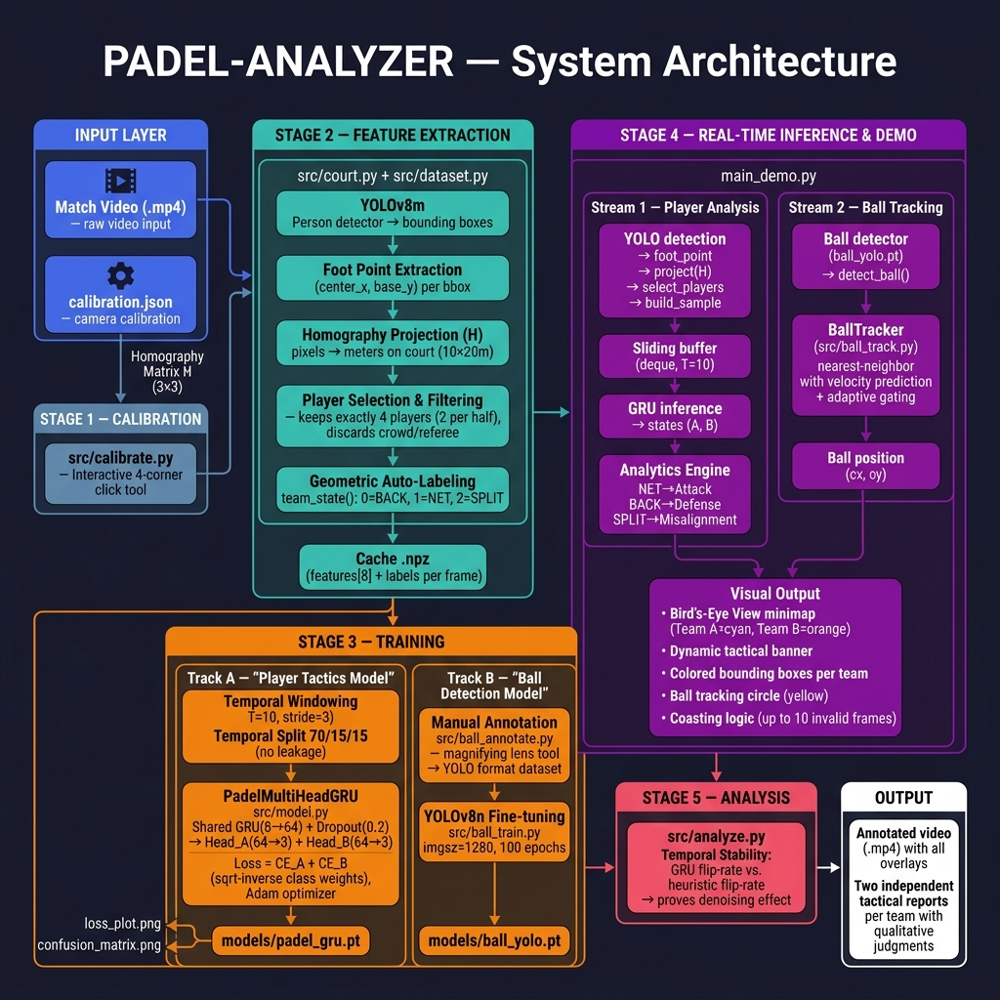
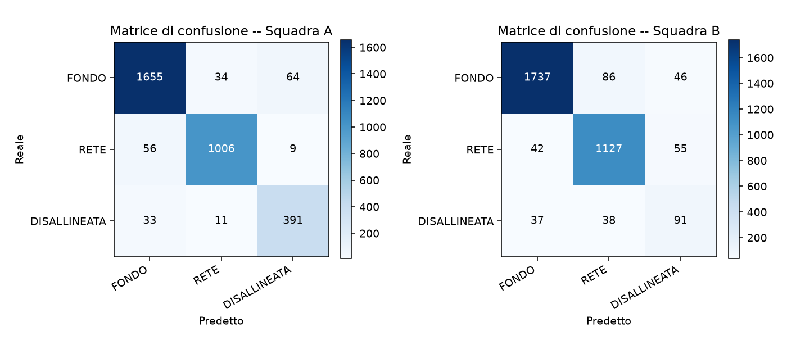

<h1 align="center">🎾 PADEL-ANALYZER</h1>

<p align="center">
  <em>Match analytics per il padel: dai video di broadcast all'analisi tattica automatica delle due coppie.</em>
</p>

<p align="center">
  
  
  
  
</p>

PADEL-ANALYZER trasforma un video a **telecamera fissa** di una partita di padel
in **due report tattici indipendenti** (uno per coppia), quantificando quanto
tempo ogni squadra passa in **attacco**, **difesa** o **disallineamento**.

La pipeline rileva i 4 giocatori con YOLO, ne proietta il punto-piede su un
modello metrico del campo (vista dall'alto / *Bird's-Eye View*) tramite
un'omografia, scarta automaticamente replay e cambi inquadratura, e classifica
la dinamica tattica nel tempo con una **GRU multi-head** — un blocco ricorrente
condiviso con **due teste indipendenti**, una per squadra, che modella la
*coesistenza* degli stati (una coppia può attaccare mentre l'altra difende).

> Progetto finale del corso **AI-LAB** — ACSAI, Sapienza Università di Roma.

---

## 🧠 Architettura



Il flusso, in breve:

1. **Detection** — YOLOv8 rileva le persone in ogni frame.
2. **Omografia** — il punto-piede di ogni giocatore è proiettato sul campo 10×20 m.
3. **Filtro di validità** — si tengono solo i frame con esattamente 4 giocatori in campo, 2 per metà (esclude pubblico, arbitro, replay).
4. **Etichettatura geometrica self-supervised** — 3 stati per coppia da soglie geometriche (nessuna annotazione manuale).
5. **GRU multi-head** — finestre temporali di 10 frame → stato tattico di A e B.
6. **Report** — percentuali di tempo per situazione, con giudizio qualitativo automatico.

### Stati e situazioni tattiche

Per ogni squadra la posizione della coppia è codificata in **3 stati**, mappati
1:1 sulle 3 situazioni tattiche (i due report sommano quindi esattamente al 100%):

| Stato | Definizione geometrica | Situazione |
|-------|------------------------|------------|
| `1` RETE | coppia compatta, media < 5 m dalla rete | **Attacco** |
| `0` FONDO | coppia compatta, media ≥ 5 m dalla rete | **Difesa** |
| `2` DISALLINEATA | giocatori sfasati in profondità > 4 m | **Disallineamento** |

---

## 📊 Risultati

| Testa | Accuratezza | F1 macro |
|-------|:-----------:|:--------:|
| Squadra A (lato vicino) | **0.94** | **0.92** |
| Squadra B (lato lontano) | 0.91 | 0.79 |

- **Regolarizzazione temporale**: la GRU riduce i cambi di stato spuri da **27.5 a 19.4 al minuto** (−30%) rispetto all'euristica geometrica istantanea.
- **Detector pallina**: ~**96%** di rilevamento sul video demo mai visto (vs ~18% di uno YOLO generico).

<p align="center">
  
</p>

---

## ⚙️ Installazione

```bash
git clone https://github.com/<tuo-utente>/padel-analyzer.git
cd padel-analyzer
pip install -r requirements.txt
```

> Il repo usa **Git LFS** per i modelli allenati (`models/*.pt`) e i documenti
> (`.pptx`, `.pdf`): assicurati di avere [Git LFS](https://git-lfs.com) installato
> prima del clone (`git lfs install`).

### Dati non inclusi nel repo

Per mantenere il repository leggero, **non** sono versionati:

- I **video** (`data/*.mp4`) — vanno procurati a parte e messi in `data/`.
- I **pesi base YOLO** (`yolov8m.pt`, `yolov8n.pt`) — scaricati **automaticamente**
  da Ultralytics al primo avvio.
- Le **immagini** del dataset pallina — versionate solo le annotazioni
  (`data/ball_ds/labels/`).

I **modelli già allenati** (`models/padel_gru.pt`, `models/ball_yolo.pt`) sono
inclusi via LFS: la demo funziona senza dover riaddestrare nulla.

---

## 🚀 Quickstart (demo)

Con un video in `data/demo.mp4` e `calibration.json` presente:

```bash
# demo interattiva su un tratto (SPAZIO = pausa | n = avanti | q = esci)
python main_demo.py --video data/demo.mp4 --start 120 --duration 60
```

La finestra mostra: box giocatori colorati per squadra, mini-mappa BEV, banner
tattico, tracking della pallina (cerchio giallo + scia). Al termine stampa i due
report finali.

Per salvare una copia annotata senza finestra:

```bash
python main_demo.py --video data/demo.mp4 --save output_demo.mp4 --no-show
```

> Su hardware **senza GPU** conviene alleggerire: `--no-ball --yolo yolov8n.pt`.

---

## 🔧 Pipeline completa (da zero)

<details>
<summary>Espandi: calibrazione → estrazione → training → analisi</summary>

### 1. Calibrazione dell'omografia
Clicca i 4 angoli del campo (vicino-sx, vicino-dx, lontano-dx, lontano-sx). Va
fatta una volta per telecamera:
```bash
python -m src.calibrate --video data/match_video.mp4 --time 30 --out calibration.json
```

### 2. Estrazione delle traiettorie (YOLO → cache `.npz`)
Stadio più lento (usa la GPU se disponibile), eseguito una volta per video:
```bash
python -m src.dataset --video data/match_video.mp4   --calib calibration.json --out data/cache/set1.npz
python -m src.dataset --video data/match_video_2.mp4 --calib calibration.json --out data/cache/set2.npz
```

### 3. Addestramento della GRU multi-head
Split temporale 70/15/15 per partita, poi concatenato (nessun leakage):
```bash
python -m src.train --caches data/cache/set1.npz data/cache/set2.npz --epochs 40
```
Produce `models/padel_gru.pt`, `loss_plot.png`, `confusion_matrix.png`.

### 4. Analisi oggettiva (stabilità temporale)
```bash
python -m src.analyze --cache data/cache/set2.npz --model models/padel_gru.pt
```

</details>

<details>
<summary>Espandi: tracking della pallina (detector dedicato)</summary>

Un detector YOLOv8 messo a punto (*fine-tuning*) su ~300 fotogrammi annotati a
mano, ad alta risoluzione (1280 px). È integrato nella demo (attivo di default se
esiste `models/ball_yolo.pt`, disattivabile con `--no-ball`).

```bash
# annotazione (lente d'ingrandimento per un oggetto di pochi pixel)
python -m src.ball_annotate --video data/match_video.mp4 --cache data/cache/set1.npz --n 300

# training del detector
python -m src.ball_train --data data/ball_ds --imgsz 1280 --epochs 100

# tester visivo (solo traccia)
python -m src.ball_track --video data/demo.mp4 --start 120 --duration 30
```

> Il detector è **specifico per la telecamera/campo** su cui è stato annotato.

</details>

---

## 📁 Struttura del progetto

```
padel_analyzer/
├── main_demo.py           # demo: video annotato + report tattici finali
├── calibration.json       # omografia (4 angoli del campo)
├── requirements.txt
├── src/
│   ├── court.py           # geometria, omografia, etichettatura, mini-mappa
│   ├── calibrate.py       # calibrazione interattiva dell'omografia
│   ├── dataset.py         # estrazione YOLO + cache + Dataset temporale
│   ├── model.py           # PadelMultiHeadGRU
│   ├── train.py           # training multi-task + grafici
│   ├── analytics.py       # logica tattica a 3 categorie + report
│   ├── analyze.py         # analisi oggettiva (stabilità temporale)
│   ├── ball_annotate.py   # annotazione pallina → dataset YOLO
│   ├── ball_train.py      # training del detector pallina
│   └── ball_track.py      # tracking pallina a video
├── models/                # modelli allenati (Git LFS)
└── data/                  # video (non versionati) + cache + dataset pallina
```

---

## ⚠️ Limiti noti

- Le **occlusioni** tra giocatori fanno fallire il vincolo "4 in campo" e riducono la copertura.
- L'omografia è **sensibile alla calibrazione**: piccoli errori sugli angoli spostano le soglie di stato.
- Le etichette sono **geometriche** (self-supervised): la GRU ne apprende una versione temporalmente coerente, non una verità tattica esterna. La classe *disallineata* resta la più difficile, specie per la squadra lontana (misurata con meno precisione per la compressione prospettica).

---

## 👤 Autore

**Dario Ojog** — Bachelor in Applied Computer Science and Artificial Intelligence (ACSAI)
Corso AI-LAB · Sapienza Università di Roma
